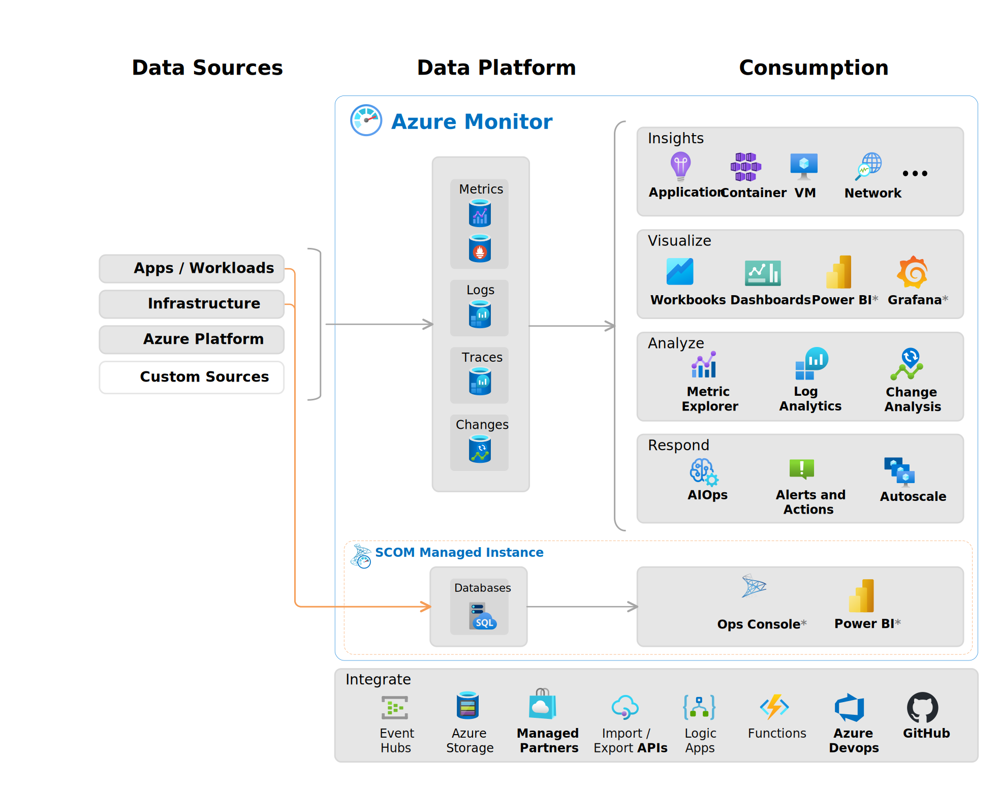

# Prerequisites
- Az Admin Exam (Optional)
- Az Fundamental Understading
- Basic Hands-On Experience.
- Scripting languages.

# Sections of Exam
- Develop an instrumentation strategy [5-10%]
- Develop a site reliability Engineerig (SRE) Strategy [5-10%]
- Develop a security and compliance plan
- Manage Source Control [10-15%]
- Facilitate communication and collaboration
- Define and implement continous integration [20-25%]
- Define and implement a continous delivery and release management strategy [10-25%]

# 1. Develop an instrumentation strategy
- Monitor and Measure Performance
- Detect Errors
- Trace Information
- Visibility, Notifications, Cost Efficiency.

### Design and Implement Strategies
- Logging: A log aggregation and query strategy using Azure Monitor.
- Telemetry: Define and measure key metrics, such as CPU, network and disk.
- Alerts: Implement metric alerts to notify team members.

### Azure Monitor
  
- How various applications are doing and issues that may occur.
- Data Collected
  - Application
  - OS
  - Azure Resources (Such as ExpressRoute)
  - Azure Subscription
  - Azure Tenant
- Collected data flows through Logs and Metrics.
- Metrics
  - Performance of resources
  - Consumption of resources
- Extend Data Collection
  - Enable diagnostics and add an agent
  - Enable monitoring with application insights

 You can go to monitorig by
 -> Select VM -> Overview -> Monitoring;
 -> If above info is not enough we can see more details on monitoring in left pane
 -> Insights, Alert, Metrics, Diagnostic setting, Logs, Connection Monitor, Workbooks are all parts of Monitoring.

## Key Metrics
- Input
  - Azure Resources (CPU, Memory, Disk, Network)
    - Monitoring -> Metrics -> Fill the details like Scope, Metric Namespace (Custom Guest)-> Metric (Logical disk disk writes) -> Aggregation (Average).
  - Applications
  - Virtual Machine Agents
  - Custom Metrics
- Metrics
  - Insights
  - Dashboards
  - Workbooks
  - Metrics Explorer
  - Metric Alerts
    - VM -> Monitoring -> Alert -> Create alert rule (As you have gone here through VM, VM details will be autofilled ->
    - Condition (Add Condition), Outbound(Outbound Flows) , Operator (>) -> Aggregation Average -> Threshold Value (Some Percentage)
    - Action Group -> Create/Add Action Group

# 2. Develop a site reliability Engineerig (SRE) Strategy
- Main benefit of SRE Strategy is it reduces downtime.

## Healthcheck
### Health Check Types
- Contaier liveness and readiness probes
- Startup
- Shutdown

### Azure Container Instances
- Support Readiness Probes
- Deploying container group that involves readiness Probe

    Console
    create readiness-probe.yml file
    > az container create --resource-group `<resource-group-name> --file <yaml file>`
 ### Health Check Alerts
 - Service Health-> Resource Health -> Add Resource Health -> Select Resource Type, Group -> Resource
 - Alert Condition: Select Accordingly.
 - Actions -> Add Action Group (Use any action group you created)
 - Alert rule details. (Alert rule name, resource group)
 - Restart the VM. It will trigger the alert as alert is monitoring it.

# 3. Develop a security and compliance plan
## Azure Key Vault
  - Securely Store keys, Passwords, Certificates.
  - az keyvault create --name `keyvault-name` --resource-group <rg name> --location 'EastUs'
  - Create secret and store in keyvault
  - az keyvault secret set --vault-name `vault-name` --name `secret-name` --value `secret-value`
  - For Retrieving secret
  - az keyvault secret show --name `key-name` --vault-name `vault-name` --query "value"
 ## Azure Policy
 - A rule to control specific security conditions.
 - For example, preventing users form specific teams from accessing passwords stored in a key vault.
 - We use azure policy to Manage Cost, Prevent Malicious Activity, Implement Resources
- MS already has set of policies defined.
- To Assign Policy; Policy -> Select policy in search -> do necessary changes. 

## Break the Glass Strategy
- Security Incident Response
- What to do in case of emergency
- Steps
  - Notify
  - Review attack playbook
  - Access your break glass account
  - Get Help from MS Support
  - Azure AD Sign-in accounts
  - Monitor
  - Save backup logs

# 4. Manage Source Control
- Azure Repos
- Devs -> Access Portal -> Cotainer[Code in repo]

### Integrate Github with Azure Repo
- Click Repos -> Repo Dropdown -> Import -> Select Repository Type and link. : 
- Branching Strategies:
  - Trunk based

# 5. Facilitate communication and collaboration
## Communication and Collaboration.
- Communicating deployments and release information with business stakeholders
- Generaing DevOps process documetation
- Automating communication with team members and open source technologies.
- Create Dashboards, Pipelines, Integrate Github with Azure Boards.

# 6. Define and implement continous integration
## Continuous Integration
- Design build automation
- Implement a build strategy.
- Maintaining a build strategy.

## Testing
- Integration
- Fuzz : Find bugs by randomly providing input
- Load
- API Testing
- Chaos Testing

## Build Pipelines
- Automatically run builds
- Perform tests
- Deploy code to development and prod environments.

# 7. Define and implement a continous delivery and release management strategy.
- Deeloping deployment scripts and templates.
- Implementing an orchestration automation solution.
- Planning the deployment environment strategy.

## Infrastructure as a Code [IAC]
- Teraform (Uses HCL: Hashicorp Code Language)
- ARM
- CDM and many more.

## Release Pipeline
- Artifact
  - Deployable component of your application
  - e.g. .net,.jar,docker image file
- Stages
  - QA, DEV, INT

## Release strategy design.
### Blue/Green
- Gradually transferring user traffic from old(blue) environment to new (green). One whole traffic has been transferred old env. can stay idle.
### Canary
- Incremetally to a subset of users.
- 2%, 50%, 100%
### Ring
- Groups receive new features gradually.

## Release Strategy Implementation
- Azure Traffic Manager
  - Distribute traffic to your public-facing applicaiton across the global azure regions.
### Priority Routing Method.
### Weighted Routed Method.
### Performance Routed Method.
### Deplyment Slots
  - Validate Slots.
  - Swap Slots.
  - App Service -> Deployment -> Deployment Slots.
